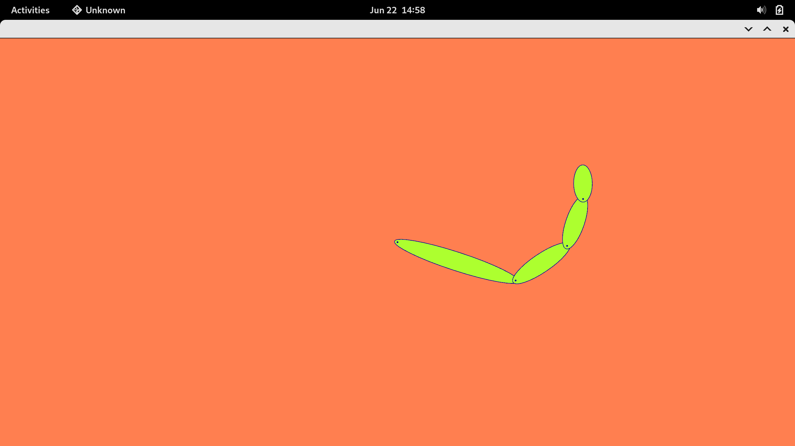

# invk
Experimenting with inverse kinematics algorithms

Works with 2D planar revolute-joint robots

Provides two binaries:

- `direct.rs` to demonstrate the display of a robotic arm with joint angles varying over time
- `inverse.rs` which uses the inverse kinematics algorithm to set the end of the arm to the coordinates of the mouse. See screenshot.

Run using `cargo run --release --bin inverse` or `cargo run --release --bin direct`

Uses a gradient-descent algorithm to compute the inverse kinematics numerically.
The graphics display is done using [nannou](https://github.com/nannou-org/nannou).